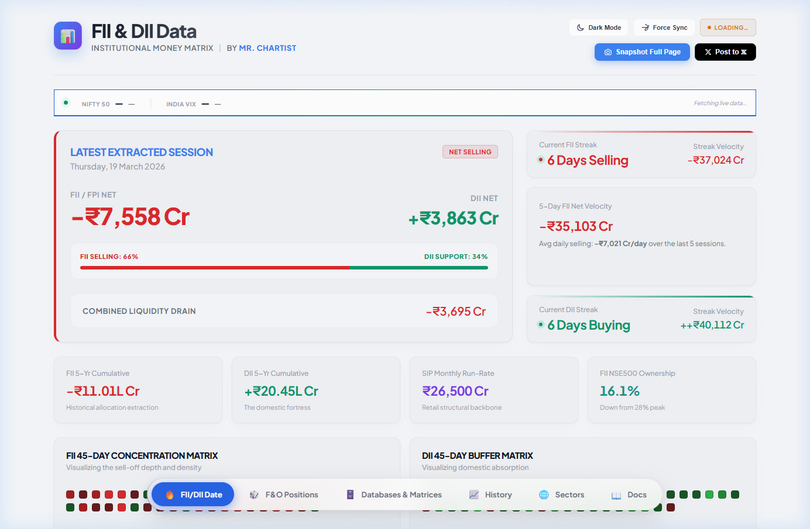
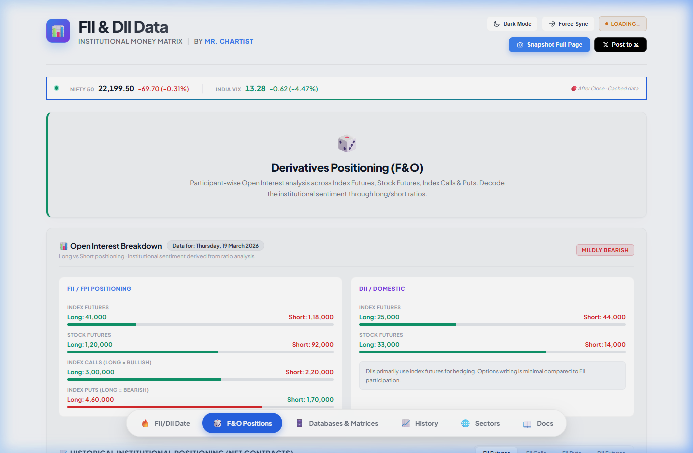
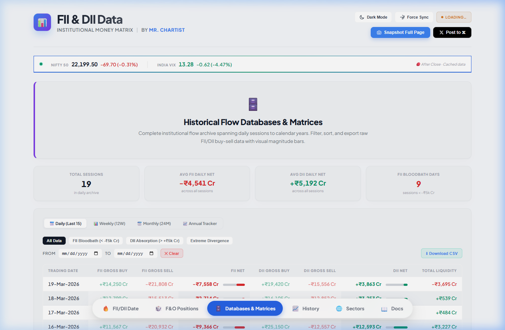
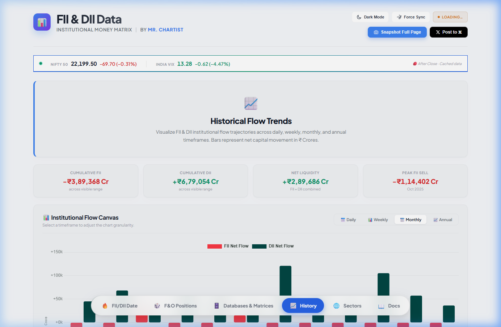
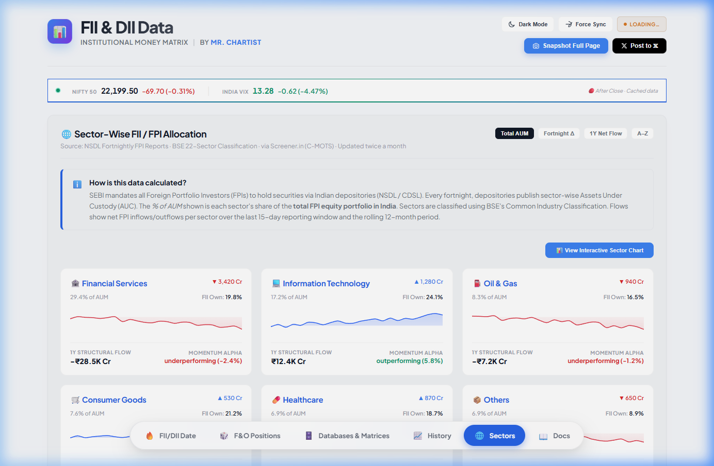
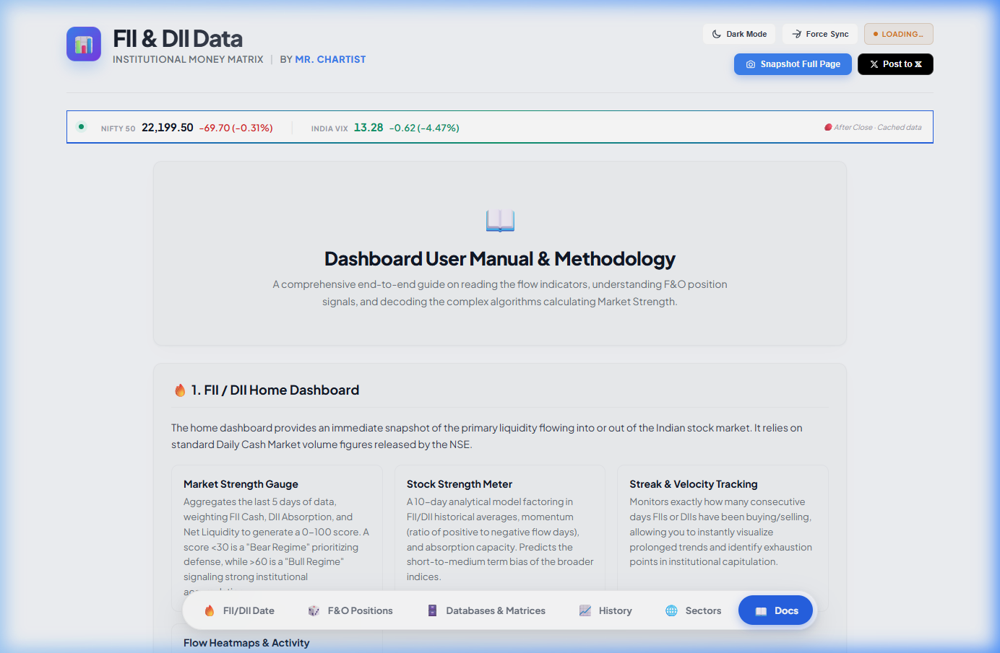

<p align="center">
  
</p>

# 📊 FII & DII Data — Institutional Money Matrix

> **Live Dashboard** for tracking Foreign Institutional Investor (FII/FPI) and Domestic Institutional Investor (DII) flows in Indian equity markets.
>
> 🌐 **Live at:** [fii-diidata.mrchartist.com](https://fii-diidata.mrchartist.com/)
>
> Built by [@mr_chartist](https://twitter.com/mr_chartist)

---

## ✨ Features

| Feature | Description |
|---------|-------------|
| 🔴 **Real-Time FII/DII Flows** | Latest net buy/sell data with flow strength meter |
| 📈 **45-Day Heatmaps** | GitHub-style concentration matrices for FII sell-off depth & DII absorption |
| 🎲 **F&O Derivatives** | Participant-wise Open Interest (Long vs Short ratio bars) |
| 🗄️ **Multi-Timeframe Tables** | Daily, Weekly, Monthly & Annual archives with magnitude bars |
| 📈 **Interactive Charts** | Chart.js-powered flow visualizations with timeframe toggles |
| 🌐 **Sector Allocation** | NSDL fortnightly FPI sector data with sparkline trends |
| 🌙 **Dark / Light Mode** | OLED black dark mode & clean light theme |
| 📷 **Full-Page Export** | html2canvas-powered screenshot & Post to 𝕏 |
| 📱 **PWA Installable** | Progressive Web App with offline support |
| 🔍 **SEO Optimized** | JSON-LD structured data, Open Graph, canonical URL |

---

## 📸 Tab-by-Tab Walkthrough

### 1. 🔥 FII/DII Date (Home)

The default landing view. Shows the **latest extracted session** with:

- **Hero Card** — FII/FPI Net vs DII Net with a red/green accent border indicating flow direction
- **Flow Strength Meter** — Visual split showing FII aggression vs DII support percentage
- **Streak Trackers** — Current consecutive buying/selling days with cumulative velocity
- **Quick Stats** — 5-Year cumulative flows, SIP run-rate, FII NSE500 ownership
- **45-Day Heatmaps** — Color-coded concentration matrices (FII sell depth & DII absorption)


---

### 2. 🎲 F&O Positions

Derivatives positioning analysis with:

- **Hero Banner** — Quick overview of what the F&O section covers
- **Sentiment Badge** — Mildly Bearish / Bullish / Neutral classification
- **Open Interest Breakdown** — FII vs DII positioning across:
  - Index Futures (Long vs Short ratio bars)
  - Stock Futures
  - Index Calls (Long = Bullish)
  - Index Puts (Long = Bearish)
- **Historical Positioning Chart** — 20-period trajectory of FII Futures, Calls, Puts & DII Futures



---

### 3. 🗄️ Databases & Matrices

Complete institutional flow archive with:

- **Hero Banner** — Archive description with purple accent border
- **Summary Stats** — Total Sessions, Avg FII/DII Daily Net, FII Bloodbath Days (< -₹5k Cr)
- **4 Timeframe Sub-Tabs:**
  - 📅 **Daily (Last 15)** — Full buy/sell/net with magnitude bars, filterable (Bloodbath, Absorption, Divergence)
  - 📊 **Weekly (12W)** — Aggregated weekly flows with trend signals
  - 📆 **Monthly (24M)** — Monthly aggregates with Nifty market change correlation
  - 📈 **Annual Tracker** — Calendar year totals with Domestic Multiplier ratios
- **Date Range Filter** — Custom FROM/TO date filtering
- **CSV Export** — Download filtered data as CSV



---

### 4. 📈 History (Flow Trends)

Interactive charting engine with:

- **Hero Banner** — Blue accent border with trend description
- **4 Dynamic Stats Cards** — Cumulative FII, DII, Net Liquidity & Peak FII Sell (updates per timeframe)
- **Chart.js Canvas** — 450px tall interactive bar chart (FII red bars vs DII green bars)
- **Timeframe Toggles** — Daily / Weekly / Monthly / Annual switches
- **Color-Coded Legend** — Swatch boxes for FII (red) and DII (green)
- **AI Insight Strip** — Dynamic text summary that changes per timeframe



---

### 5. 🌐 Sectors

NSDL Fortnightly FPI Allocation data with:

- **Methodology Explainer** — How SEBI/NSDL sector data is calculated
- **Sector Cards Grid** — 3-column responsive layout showing:
  - Sector name, AUM %, FII Ownership %
  - Sparkline mini-charts
  - 1Y Structural Flow & Momentum Alpha
- **Interactive Sector Chart** — Toggleable Bar / Line / Scatter Math views
- **Sort Modes** — Total AUM, Fortnight Δ, 1Y Net Flow, A-Z



---

### 6. 📖 Docs

Comprehensive documentation covering:

- **Dashboard Architecture** — 6-tab system overview
- **Data Sources** — NSE TRDREQ, NSDL FPI Reports, BSE Classification
- **Methodology** — How FII/DII data is extracted and processed
- **Feature Guide** — Tab-by-tab feature documentation
- **Formulas** — Flow Strength Meter, Momentum Alpha, Streak calculations
- **Export Tools** — Screenshot, CSV, Post to 𝕏



---

## 🛠️ Tech Stack

| Technology | Usage |
|-----------|-------|
| **HTML5** | Single-file monolithic dashboard |
| **CSS3** | Custom properties, OLED dark mode, glassmorphism |
| **JavaScript** | Vanilla JS with Chart.js 3.9.1 |
| **Chart.js** | Interactive bar/line/scatter charts |
| **html2canvas** | Full-page screenshot export |
| **Socket.IO** | Real-time WebSocket live updates |
| **PWA** | Service Worker + Web App Manifest |

## 📂 Project Structure

```
FII and DII data/
├── fii_dii_india_flows_dashboard.html   # Main dashboard (single file)
├── server.js                            # Express + Socket.IO backend
├── manifest.json                        # PWA manifest
├── sw.js                                # Service Worker
├── robots.txt                           # Search engine crawler rules
├── sitemap.xml                          # XML sitemap for SEO
├── vercel.json                          # Vercel deployment config
├── data/
│   └── fiidii.db                        # SQLite database
├── icons/
│   ├── icon-192.png                     # PWA icon (192x192)
│   └── icon-512.png                     # PWA icon (512x512)
├── screenshots/                         # Tab screenshots for README
│   ├── 01_home_fii_dii_date.png
│   ├── 02_fno_positions.png
│   ├── 03_databases_matrices.png
│   ├── 04_history.png
│   ├── 05_sectors.png
│   └── 06_docs.png
└── README.md                            # This file
```

## 🚀 Quick Start

1. **Install dependencies:** `npm install`
2. **Development:** `npm run dev` (starts with nodemon auto-reload)
3. **Production:** `NODE_ENV=production npm start` (enables HSTS, cache-control)
4. **Open:** Navigate to `http://localhost:5000`

## ☁️ Deployment

### Vercel
```bash
npx vercel --prod
```
The included `vercel.json` handles routing automatically.

### Hostinger / VPS
```bash
npm install
NODE_ENV=production node server.js
```
Use a process manager like PM2: `pm2 start server.js --name fii-dii`

## 📊 Data Updates

- **Manual:** Data is embedded in the HTML file as JavaScript arrays
- **Auto (GitHub Actions):** Pushes to `data/latest.json` which the dashboard auto-fetches
- **Live (WebSocket):** Connects to `localhost:5000` Socket.IO server for real-time updates

## 🔗 Links

- **Live Dashboard:** [fii-diidata.mrchartist.com](https://fii-diidata.mrchartist.com/)
- **Twitter/X:** [@mr_chartist](https://twitter.com/mr_chartist)

---

<p align="center">
  <b>Made with ❤️ by Mr. Chartist</b><br>
  <i>Institutional Money Matrix — Where the smart money flows</i>
</p>
